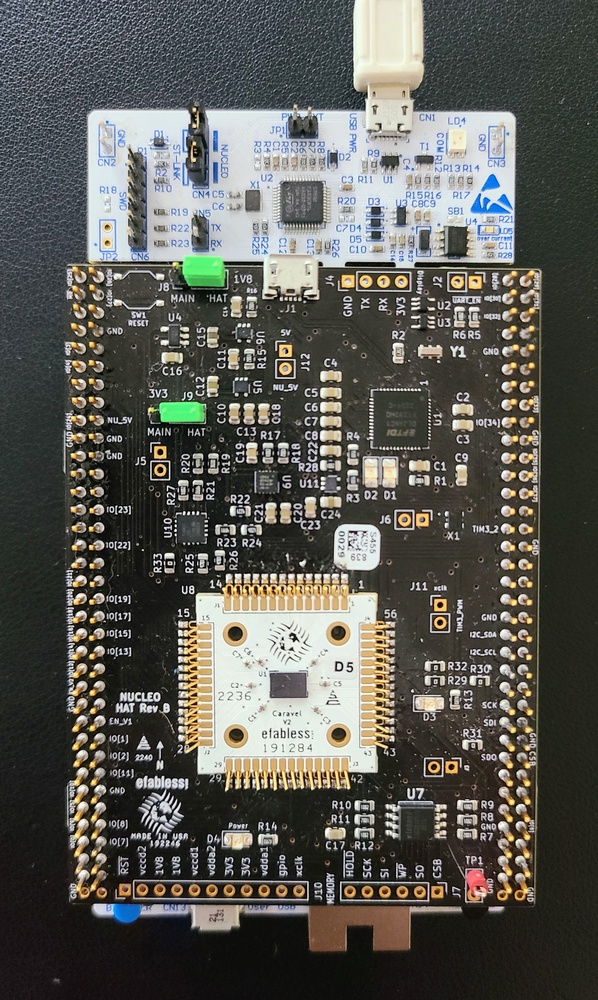

# Caravel Nucleo Hat

This directory provides a diagnostic software for characterizing timing failure patterns between GPIO pads on Caravel 
for the MPW-2, MPW-3 and related shuttles.

The diagnostic runs on a STM Nucleo development board in combination with a Caravel Hat board that hosts the Caravel 
part under test.

The current version of this document can be found at

https://github.com/efabless/caravel_board/blob/main/firmware_vex/nucleo/README.md

or scan the QR code...


## Setup

### COMPONENTS

- NUCLEO-F746ZG or NUCLEO-F413ZH
- Caravel Nucleo Hat
- One or more Caravel breakout boards with a Caravel part installed
- Two jumpers for J8 & J9
- USB micro-B to USB-A cable

### CONFIGURATION

1. Install the jumpers on J8 and J9 in the 'HAT' position to enable the board to be powered by the Nucleo. 
2. Plug the Caravel Nucleo Hat in Nucleo board pins 
   - The USB on the hat should face the ST-LINK breakoff board on Nucleo and away from the push buttons on Nucleo
   - IMPORTANT: the FlexyPin socket allows you to swap breakout boards with different parts.  You do not need to solder 
  any pins.
   - Be careful not to bend a pin when inserting the breakout board.  If one of the pins bend, use needle-nose pliers to 
  re-straighten it.
   - When pressing the Caravel Hat board on the pin headers of the Nucleo, only press far enough to engage the pins.  If
   you press to far, you can short the Flexy pins under the board against jumpers on the Nucleo.
   

3. Install a Caravel Breakout board into the socket on the Caravel Hat board
     - The Efabless logo should face the USB connector on the Hat
     

4. Connect the USB cable from the connector CN1 on the Nucleo to your workstation / laptop.
5. Connect a second USB cable from your desktop / workstation from connector CN13 on the opposite side the Nucleo board 
   from the ST-LINK breakaway board.
   - This port presents a mountable volume for the Flash filesystem on Nucleo and is how the software and firmware files
   on copied on to Nucleo. It is also used to retrieve the gpio_config_def.py file after the diagnostic completes.

<div align="left" style="margin-left: 30px; margin-bottom: 30px;">
</div>

### INSTALLATION

1. Install the required tools including **mpremote**, **mpy-cross** and **rshell**.  The diagnostic runs on a customized
   Micropython image on the Nucleo board.  The Nucleo firmware image, diagnostic software and Makefile targets for 
   installing and running the routines are located in the `firmware_vex/nucleo` directory in the caravel_board repo.

```bash
  git clone https://github.com/efabless/caravel_board.git
  cd caravel_board/firmware_vex/nucleo
  make setup
```

- **mpremote** is used for connecting the Micropython
- **mpy-cross** is a cross compiler for Micropython the compiles a python file into a binary format which can be run in 
micropython.  It is used here to reduce the size of the files because the size of the flash on the Nucleo board is 
limited on some models.

2. You will also need to install the **stlink** tools for your client.   These are required to flash Micropython firmware on the Nucleo board.

- For macOS:

```bash
      brew install stlink
```

- For other platforms, see instructions on the github STLINK project README...

   - https://github.com/stlink-org/stlink/tree/master

3. After you made both USB connections, you will need to find the path for the Flash volume.  

   - On MacOS, it should be located at `//Volumes/PYBFLASH`.
   - On Ubuntu, it should be mounted at `/media/<userid>/PYBFLASH`.
   - You will need to `export FLASH=<path>` or set the path in the Makefile at the top of the file.
   - NOTE: For some linux platforms, the PYBFLASH volume is not automatically
   
### FINDING YOUR DEVICE

```bash
  mpremote connect list
```

This will verify you can see the Nucleo board through **mpremote**.  The Makefile 
will automatically find and set the device variable.

### UPDATE THE DIAGNOSTIC SOFTWARE

It will be required to update the diagnostic software to get the latest enhancements and bug fixes.

You can find the model of the Nucleo board on a label in the lower
left corner of the Nucleo board opposite the ST-LINK breakaway board.

Run one of the following make targets based on the model of your Nucleo board. 

```bash
# for the F746ZG Nucleo board
make F746ZG

# for F413ZH
make F413ZH
```

You can also just recompile and copy the files onto the flash by running on of the following make targets:

```bash
# for the F746ZG Nucleo board
make F746ZG-copy

# for F413ZH
make F413ZH-copy
```

After the flash completes, check the version of the software...

```bash
make version

io_config -- version 1.1.0
```


### RUNNING THE DIAGNOSTIC

To run the diagnostic, enter the following commands.  The command depends on whether your project uses **Caravel** or 
**Caravan** (for analog).  

The PART variable is an ID for the part you are testing defined by
you.  It will be recorded in the output of the test for future reference.

```bash
cd caravel_board/firmware_vex/nucleo

## for digital (or analog) projects using Caravel & user_project_wrapper
make run PART=<part id>

## for analog projects using Caravan & user_analog_project_wrapper
make run_analog PART=<part id>

```

The test will begin with the green LED on the Nucleo flashing 5 times.  

When the test concludes, the green and red leds will be as follows:

| GREEN            | RED              | STATUS                                                   |
| ---------------- | ---------------- | -------------------------------------------------------- |
| 2 short + 4 long | off              | Full Success    - BOTH IO chains configured successfully |
| 2 long           | 2 short          | Partial Success - LOW IO chains configured successfully  |
| 4 long           | 2 short          | Partial Success - HIGH IO chains configured successfully |
| off              | 2 short + 4 long | Failed - BOTH IO chains failed to configured fully       |
| off              | solid            | Test failed to complete                                  |

Type `Ctrl-C` to exit the test diagnostid once it completes.  If the test completed for the part, run the following to retrieve the configuration file.  The file will indicated the 
IO that were successfully configured.  Successfully configured IO can be used for this part for firmware routines.

```bash
make get_config
```

The file is specific to the part you ran the diagnostic with. Each part will have a different `gpio_config_def.py` file because the timing
failure pattern will be different for each part.  

## Using the Configuration File

### RUN A SANITY CHECK

The following will run a sanity check test using the gpio_config_def.py produced from the diagnostic above.  The
`gpio_config_def.py` file is stored from the `make get_config` run above and local on your desktop. 

To run the sanity check:

```bash
cd caravel_board/firmware_vex/nucleo
make sanity_check FILE=gpio_config_def.py
```

BUILDING YOUR OWN FIRMWARE

The **gpio_test** directory (`caravel_board/firmware_vex/gpio_test`) provides example for creating your own firmware.  
We recommend you copy this directory as a template to create your own firmware.  After copying the directory, update 
`gpio_test` to your firmware name in the Makefile.

You will need to copy the `gpio_config_def.py` for your part into this directory.

Update `gpio_config_io.c` with the correct IO configuration for your project.  Each IO should be set to Management or 
User mode which defines whether the output is driven from the Management or User area.  The IO can be set to output or 
inputs with either pull-down, pull-up or no terminating resistors.

NOTE: You will not be able to configure any IO that is defined as `H_UNKNOWN` in your `gpio_config_def.py` file.  We 
recommend setting these IO (as well as any other IO you are not using) to `C_DISABLE` in your `gpio_config_io.py` file.

You can check that your IO configuration to ensure that you can achieve the desired configuration by running `make check`
from the project directory.  If the configuration can not be configured for that part, you can try changing the 
configuration or switching to a different part that can me configured. 

In your main firmware, you need to include `defs.h` and `gpio_config_io.c` at the top of your file.

Before using IO, you need to call `configure_io()`.
```c
#include "../defs.h"
#include "../gpio_config/gpio_config_io.c"

int main() {

  # initialization
  
  configure_io();
  
  # my routine using IO pads

}
```

You should leave the Caravel Nucleo board mounted and powered by Nucleo.  The timing failure pattern specified in the 
`gpio_config_def.py` is sensitive to the capacitance loading on the pins that is present when the Caravel board is
mounted on the Nucleo and may not be the same when the board is detached.

You can flash and run your firmware with the Caravel Hat mounted on the Nucleo by running:

```bash
make clean flash_nucleo
```

This will rebuild the firmware prior to flashing Caravel through the Nucleo board.  Note, you need to have both USB 
cables connected to the Nucleo to support this.  You also need to have the FLASH variable set correctly per the 
instructions in the [Installation](#installation) section below.

## Troubleshooting

If you are experiencing issues running the diagnostic, there are a few recommended items to check.

1. Once installed and powered on, check if your part is warm to the touch.  If so, you likely have a short in that part
   (or your project).  If its not in the project, try another part.
2. Check voltages for the 3.3V and 1.8V supplies in pins J8 and J9.  They should be at 3.3V and 1.6V respectively.
3. Ensure your Caravel Hat board is not pressed too far down on the pins to the Nucleo.  If it is, you may short some of
Flexy pins underneath the Caravel Hat board against jumpers from the Nucleo board.  Carefully pull and ease the board up 
on the pins of the 70 pin male headers on the Nucleo so that the female headers are just firmly connecting to the pins.
4. There is a known issue wit IO[0] and IO[1] that prevent them from being used by the management SoC as outputs.  See 
errata below.

For further details and issues, please see the 
[errata](https://docs.google.com/spreadsheets/d/1oErt0V6cgy-dxL2uRPfLjIaFMlooplvvDTThpU-rZAQ/edit?usp=sharing).

## Software

This is a flowchart that describes the Software, keywords here are Firmware `code running on caravel` and Software `code running on Nucleo board`


### Functions used by the software

The software is done in micropython and ran on the nucleo, some of the useful functions that can be used after running `make repl` and importing `io_config` are:

`version` :  displays the version of this code
`run_poweron(v)` : powers on caravel board using the nucleo, with voltage v (default is 1.6)
`run_change_power(v)` : changes 1v8 power on caravel board using the nucleo with voltage v and without resetting the 
processor.  This can be used to modify the operating power after configuring IO at a different voltage.
`run_flash_caravel()` : flashes caravel with firmware.hex on the nucleo filesystem
`run_sanity_check()` : runs the sanity check on an already existing gpio_config_def file on nucleo filesystem
`run(part_name, voltage, analog)` : runs the calibration program, analog is a flag that specifies if the project is analog