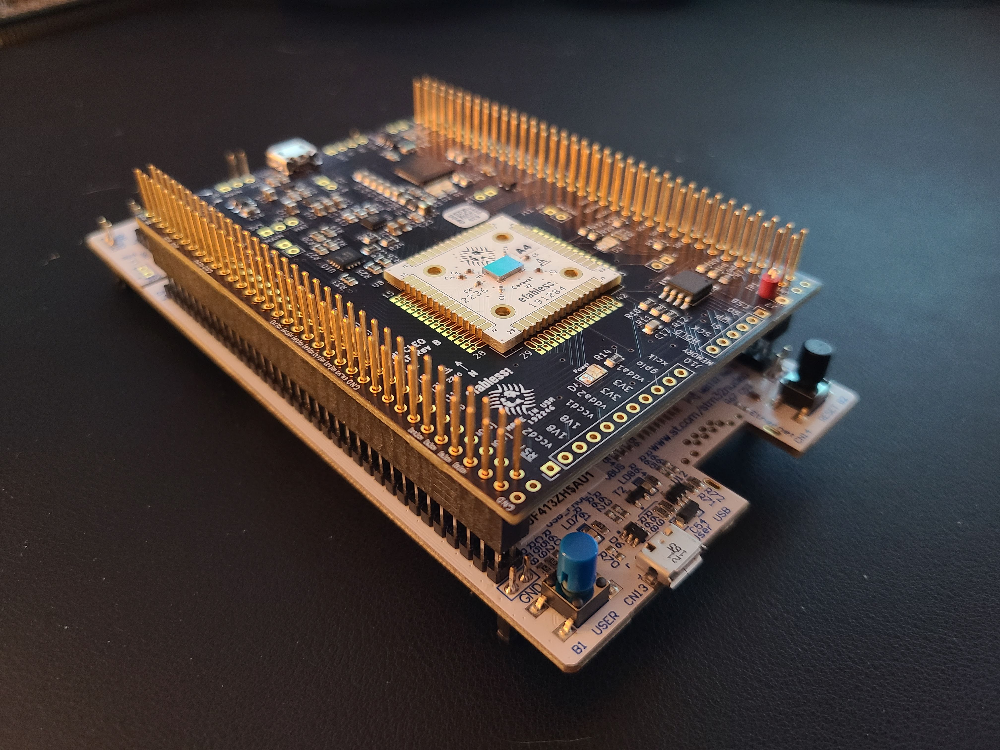

# Caravel Nucleo Hat

This directory provides a diagnostic software for characterizing timing failure patterns between GPIO pads on Caravel 
for the MPW-2, MPW-3 and related shuttles.

The diagnostic runs on a STM Nucleo development board in combination with a Caravel Hat board that hosts the Caravel 
part under test.

The current version of this document can be found at

https://github.com/efabless/caravel_board/blob/main/firmware_vex/nucleo/README.md

or scan the QR code...


## Setup

COMPONENTS
- NUCLEO-F746ZG or NUCLEO-F413ZH
- Caravel Nucleo Hat
- One or more Caravel breakout boards with a Caravel part installed
- Two jumpers for J8 & J9
- USB micro-B to USB-A cable

CONFIGURATION
- Install the jumpers on J8 and J9 in the 'HAT' position to enable the board to be powered by the Nucleo.
- Plug the Caravel Nucleo Hat in Nucleo board pins 
  - the USB on the hat should face the ST-LINK breakoff board on Nucleo and away from the push buttons on Nucleo
  - IMPORTANT: the FlexyPin socket allows you to swap breakout boards with different parts.  You do not need to solder any pins.
  - Be careful not to bend a pin when inserting the breakout board.  If one of the pins bend, use needle-nose pliers to re-straighten it.
- Install a Caravel Breakout board into the socket on the Caravel Hat board
  - the Efabless logo should face the USB connector on the Hat
- Connect the USB cable from the connector CN1 on the Nucleo to a workstation / laptop
- Clone the github repo https://github.com/efabless/caravel_board.git
- Change to the firmware_vex/nucleo directory
- Run `pip install mpremote`


<div align="left" style="margin-left: 30px; margin-bottom: 30px;">
</div>

INSTALLATION

```bash
git clone https://github.com/efabless/caravel_board.git
pip3 install mpremote
```

FINDING YOUR DEVICE

```bash
mpremote connect list
```

This will verify you can see the Nucleo board through mpremote.  The makefile 
will automatically find and set the device.


RUNNING THE DIAGNOSTIC

```bash
cd caravel_board/firmware_vex/nucleo
make run
```

The test will begin with the green LED on the Nucleo flashing 5 times.  

When the test concludes, the green and red leds will be as follows:

| GREEN            | RED              | STATUS                                                   |
|------------------|------------------|----------------------------------------------------------|
| 2 short + 4 long | off              | Full Success    - BOTH IO chains configured successfully |
| 2 long           | 2 short          | Partial Success - LOW IO chains configured successfully  |
| 4 long           | 2 short          | Partial Success - HIGH IO chains configured successfully |
| off              | 2 short + 4 long | Failed - BOTH IO chains failed to configured fully       |
| off              | solid            | Test failed to complete                                  |

If the test completed for the part, run the following to retrieve the configuration file.  The file will indicated the 
IO that were successfully configured.  Successfully configured IO can be used for this part for firmware routines.

```bash
make get_config
```

## Using the Configuration File

RUN A SANITY CHECK

The following will run a sanity check test using the gpio_config_def.py produced from the diagnostic above.  The
gpio_config_def.py file is stored from the 'make get_config' run above and local on your desktop. The file is specific
to the part you ran the diagnostic with. Each part will have a different gpio_config_def.py file.

To run the sanity check:
```bash
cd caravel_board/firmware_vex/nucleo
FILE=./gpio_config_def.py make sanity_check
```
... coming soon
