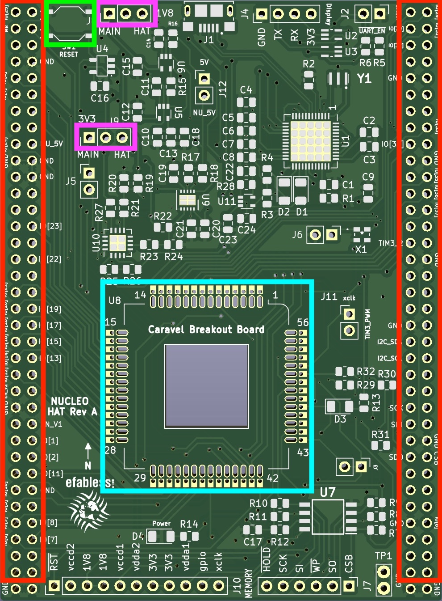
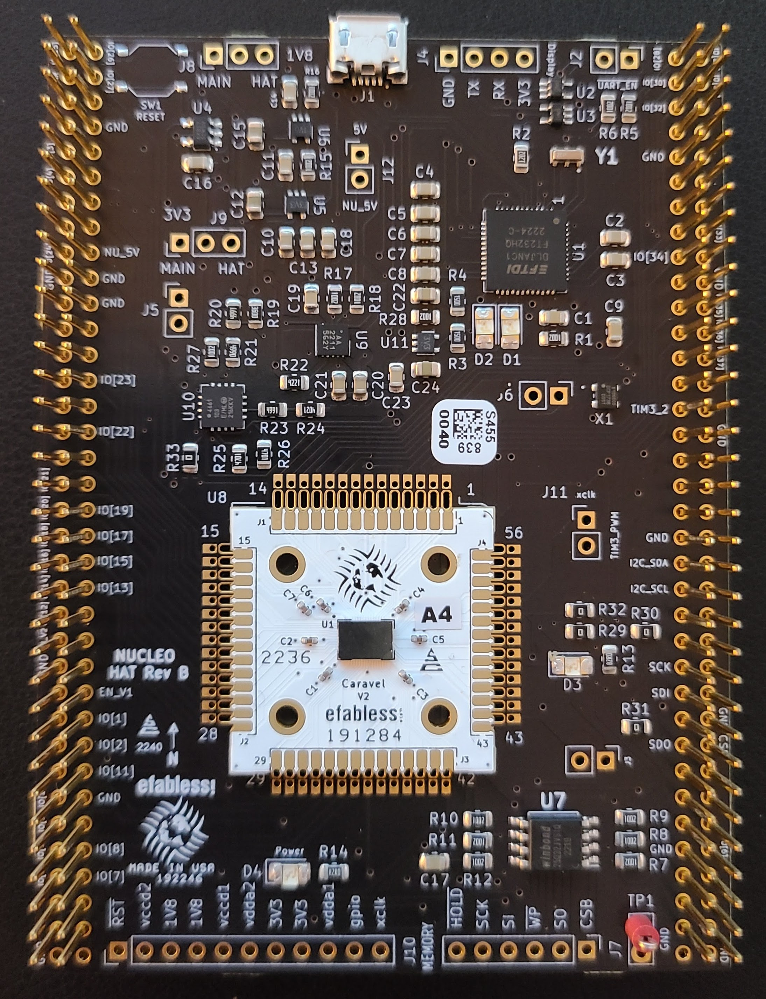
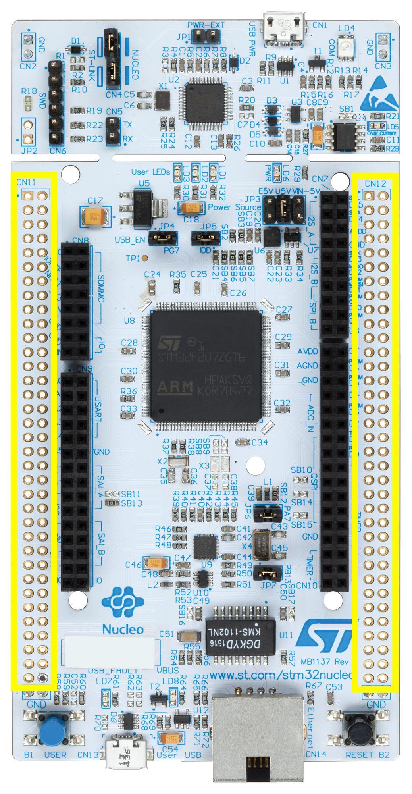
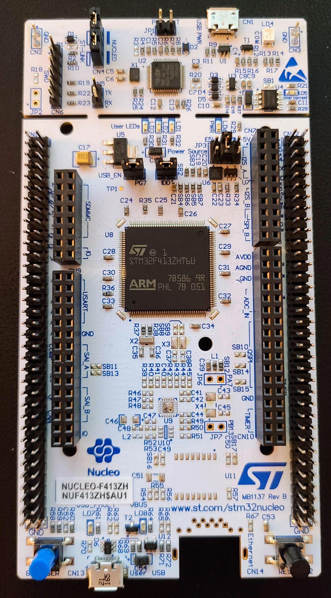

# Caravel Nucleo Hat

This directory provides a diagnostic software for characterizing timing failure patterns between GPIO pads on Caravel 
for the MPW-2, MPW-3 and related shuttles.

The diagnostic runs on a STM Nucleo development board in combination with a Caravel Hat board that hosts the Caravel 
part under test.

The current version of this document can be found at

https://github.com/efabless/caravel_board/blob/main/firmware_vex/nucleo/README.md

or scan the QR code...


## Setup

COMPONENTS
- NUCLEO-F746ZG or NUCLEO-F413ZH
- Caravel Nucleo Hat
- One or more Caravel breakout boards with a Caravel part installed
- double-row 70-pin headers for the Nucleo board
  - for connectors CN11 and CN12 
- 70-position 2-row sockets for the Caravel Nucleo Hat
  - SAMTEC P/N SSQ-135-23-G-D
  - install on BACK
- two 3-pin headers for J8 & J9 with jumpers
- 1 push button switch (SW1)
- package (100) of FlexyPins
- USB micro-B to USB-A cable

CONFIGURATION
- Install the flexy pins on in the Nucleo Hat (CYAN)
  - see demonstration video (https://youtu.be/thXuYkltXbo)
- Install the sockets on the BACK of the Caravel Nucleo Hat (RED)
  - pins should be aligned to side of board with USB connector
- Install 3-pin headers on Caravel Nucleo Hat (MAGENTA)
- Install the jumpers on J8 and J9 for 'HAT'
- (Optional)  Install push button switch in SW1 (GREEN)

<div> 
</div>

- Install the double-row headers on the Nucleo board FRONT ( CN11 and CN12 )

<div> 
</div>

- Plug the Caravel Nucleo Hat in Nucleo board pins 
  - the USB on the hat should face the ST-LINK breakoff board on Nucleo and away from the push buttons on Nucleo

<div align="center"></div>

- Install a Caravel Breakout board into the socket on the Caravel Hat board
  - the Efabless logo should face the USB connector on the Hat
- Connect the USB to a workstation / laptop
- Clone the github repo https://github.com/efabless/caravel_board.git
- Change to the firmware_vex/nucleo directory
- Run `pip install mpremote`

To run the diagnostic

```bash
git clone https://github.com/efabless/caravel_board.git

cd caravel_board/firmware_vex/nucleo

pip3 install mpremote

cd firmware_vex/nucleo

make run
```

If the test passes successfully for the part, run the following to retrieve the configuration file

```bash
make get_config
```

## Using the Configuration File

... coming soon